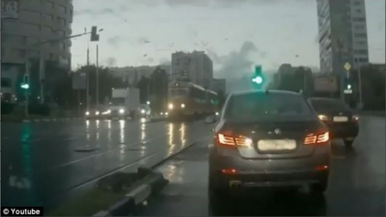

# Computer Vision - Russian License Plate Blurring

  
Russians are famous for having some of the most entertaining DashCam footage on the internet but a lot of license plates in the footages were not blurred and thus the privacy of the driver was not protected. This mini-project is to help out and create a license plat **blurring** tool to address such issue.

## Method 
Haar Cascades algorithm will be used together with the Russian license plate detector .xml file in OpenCV to blur the Russian license plates detected in an image.

## Result

The picture below shows the result of blurring the car plate.

  
